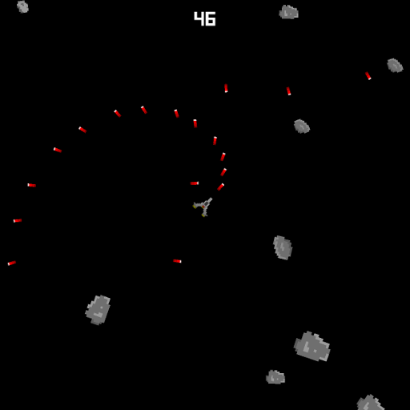

# Asteroids!

This is a simple game written in the Amethyst game engine, mimicking (a bit) the classical game of
[Asteroids](https://en.wikipedia.org/wiki/Asteroids_(video_game)).



## Building

Must be built by checking out the master version of [Amethyst](https://github.com/amethyst/amethyst)
to the parent directory.
You also need a [Rust compiler](https://rustup.rs/) capable of compiling Rust 2018 Edition.

After that, just do:

```
cargo +nightly run
```

## TODO

 * Add sounds.
 * Actually do momentum distribution when asteroids collide!
